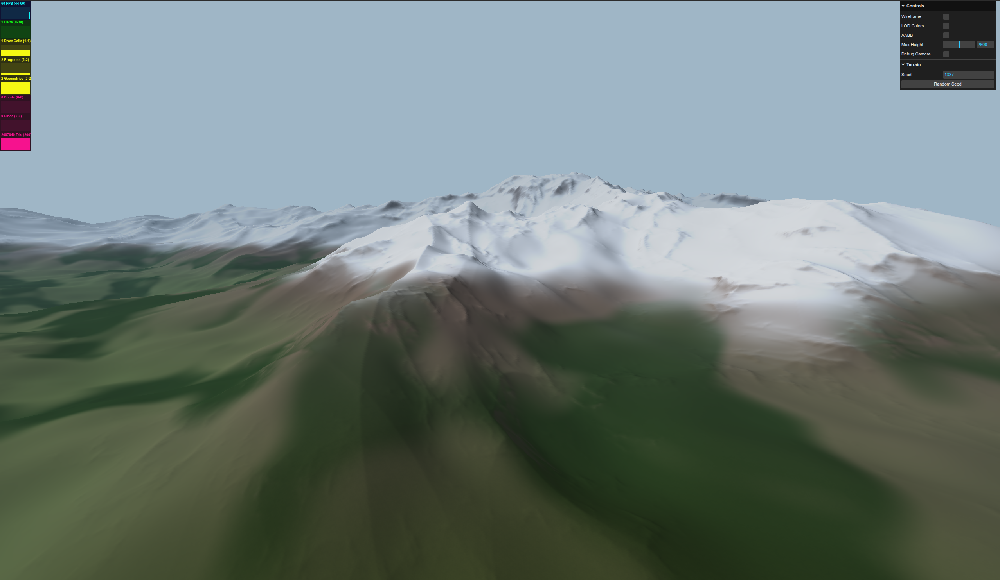

# [CDLOD](https://nickvanurk.com/cdlod/)

A terrain renderer built on **continuous distance-dependent level of detail**, the algorithm
described in Filip Strugar's [paper](https://github.com/fstrugar/CDLOD/blob/master/cdlod_paper_latest.pdf).
It draws a 16km × 16km landscape from the horizon down to the ground underfoot, in a single
draw call, with no popping between detail levels — and nothing to download, because the
terrain is generated on the GPU rather than loaded from a heightmap.



> 🌟 If you find this project interesting, please consider giving it a star — it helps others
> discover it too!

🌍 **Try it now at [nickvanurk.com/cdlod](https://nickvanurk.com/cdlod/)**

## :blush: **Why?**

I wanted to make a game like Breath of the Wild, so I started with the terrain. That turned
into a long deep dive into terrain rendering, and the part I kept coming back to was view
distance: standing on a ridge and seeing the whole map.

Drawing that much ground is a budget problem. Enough triangles to look right underfoot is far
too many by the time they reach the horizon, and few enough to reach the horizon looks faceted
up close. Level of detail is the standard fix, but most approaches have visible artifacts:
swap a chunk for a finer one and the ground jumps, or stitch chunks of different densities
together and you get cracks along the seams. CDLOD has neither, which is why I picked it. A
quadtree chooses a detail level per region based on distance, and each patch's vertices morph
toward the shape of the coarser level as they approach its range, so the geometry is already
in place by the time the swap happens. Nothing pops, and it all runs in the vertex shader.

## 🧪 What's Included

- **Quadtree LOD selection** — 8 levels over a 16km map, down to 64m patches at roughly one
  vertex per unit underfoot
- **Vertex morphing** between levels, so detail changes are continuous instead of popping
- **Frustum culling** against per-node AABBs, with bounds derived from the terrain field
  itself so the boxes hug the ground instead of spanning the whole height range
- **Analytic GPU terrain** — domain-warped ridged multifractal with a continent mask and
  2.6km peaks, evaluated in GLSL with no heightmap anywhere
- **Seeded worlds** — any integer is a different landscape, and regenerating costs a uniform
  write plus one bounds pass (~33ms) rather than a rebuild
- **Height and slope shading** — depth-graded water, a sand line, patchy noise-masked forest
  colour, and a snowline that leaves steep faces as bare rock, with aerial-perspective fog
  carrying the sense of scale
- Roughly 2M triangles at 60 FPS in **one draw call**, via a single instanced patch mesh

### Controls

Drag to pan, right-drag to orbit, scroll to zoom.

| Control | What it does |
| --- | --- |
| Wireframe | Shows the patch grid, and the morphing in action |
| LOD Colors | Tints each level, coarsest green through finest red |
| AABB | Draws the quadtree bounding boxes used for culling |
| Max Height | Rescales the peaks live, from flat to 5000m |
| Debug Camera | Detaches the view so you can fly out and watch LOD selection happen |
| Seed / Random Seed | Type a seed for a specific world, or roll a new one |

Keys <kbd>1</kbd> and <kbd>2</kbd> also switch between the main and debug cameras.

## :rocket: Technologies Used

- TypeScript
- Three.js
- GLSL
- lil-gui
- Vite

## 🛠️ Installation

These instructions will get you a copy of the project up and running on your local machine.

### Prerequisites

- [Git](https://git-scm.com/book/en/v2/Getting-Started-Installing-Git)
- [Node.js](https://nodejs.org/en/download/package-manager/)
- [npm](https://www.npmjs.com/get-npm)

The culling bounds pass reads back a float render target, so it needs a GPU with
`EXT_color_buffer_float` — any WebGL2 browser from the last several years has it.

### Installation

```
$ git clone https://github.com/nickyvanurk/cdlod
$ cd ./cdlod
$ npm i
$ npm run dev
```

## License

This project is licensed under the [MIT License](./LICENSE).
